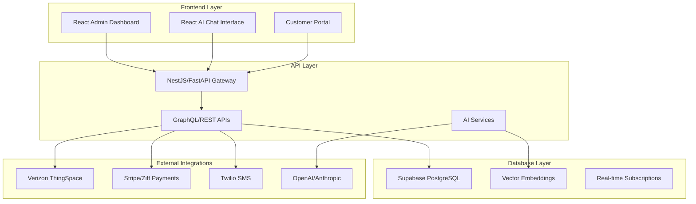

# MVNO Operations Platform - Project Structure & Implementation Plan

## 🎯 Executive Summary

This document outlines the complete implementation plan for replacing BeQuick with an AI-enhanced MVNO operations platform using Supabase as the production database.

## 📊 BeQuick Analysis vs Our Enhancement

### What BeQuick Provides (To Replace):
- ✅ Subscriber lifecycle management
- ✅ Automated billing & invoicing  
- ✅ Carrier integrations (Verizon, T-Mobile, AT&T)
- ✅ Payment processing (Stripe/Zift)
- ✅ Basic reporting (Looker integration)
- ✅ Customer portal
- ✅ SIM/device management

### Our AI-Enhanced Additions:
- 🤖 **AI Knowledge Base** - Embedding-indexed document search
- 🧠 **Plan Optimization Engine** - ML-driven cost reduction
- 💬 **AI Command Console** - Natural language bulk operations
- 📈 **Predictive Analytics** - Churn forecasting, usage prediction
- 🔄 **Advanced Automation** - Event-driven workflows

## 🏗️ Recommended Architecture

### Technology Stack



### Core Components

1. **Database (Supabase)**
   - Production-ready PostgreSQL with RLS
   - Real-time subscriptions
   - Vector similarity search for AI
   - Automatic API generation

2. **Backend Services (NestJS/TypeScript)**
   - Microservices architecture
   - Event-driven workflows
   - Carrier integration adapters
   - AI/ML pipeline integration

3. **Frontend (React + TypeScript)**
   - Admin dashboard (Material-UI/Ant Design)
   - AI chat interface
   - Real-time notifications
   - Mobile-responsive design

4. **AI Layer (Python/LangChain)**
   - Document embeddings & search
   - Plan optimization models
   - Natural language processing
   - Recommendation engine

## 📁 Project Structure

```
wingtel-ai/
├── 📁 backend/                     # NestJS/FastAPI backend services
│   ├── 📁 apps/
│   │   ├── 📁 api-gateway/         # Main API gateway
│   │   ├── 📁 billing-service/     # Billing & invoicing
│   │   ├── 📁 subscriber-service/  # Customer management
│   │   ├── 📁 ai-service/          # AI/ML services
│   │   └── 📁 integration-service/ # Carrier integrations
│   ├── 📁 libs/
│   │   ├── 📁 database/            # Supabase client & types
│   │   ├── 📁 auth/                # Authentication
│   │   └── 📁 shared/              # Common utilities
│   └── 📁 migrations/              # Database migrations
│
├── 📁 frontend/                    # React frontend applications
│   ├── 📁 admin-dashboard/         # Operator interface
│   ├── 📁 ai-chat/                 # AI chat interface
│   ├── 📁 customer-portal/         # Subscriber self-service
│   └── 📁 shared-components/       # Reusable UI components
│
├── 📁 ai-services/                 # Python AI/ML services
│   ├── 📁 knowledge-base/          # Document embedding & search
│   ├── 📁 plan-optimizer/          # Usage prediction & optimization
│   ├── 📁 recommendation-engine/   # Action recommendations
│   └── 📁 command-processor/       # Natural language processing
│
├── 📁 infrastructure/              # Deployment & infrastructure
│   ├── 📁 docker/                  # Container configurations
│   ├── 📁 kubernetes/              # K8s manifests
│   └── 📁 terraform/               # Infrastructure as code
│
├── 📁 migrations/                  # Database schema & data migration
│   ├── 01_bootstrap.sql
│   ├── 02_mvno_schema.sql
│   └── 03_data_migration.sql
│
└── 📁 docs/                        # Documentation
    ├── API.md
    ├── DEPLOYMENT.md
    └── CONTRIBUTING.md
```

## 🗄️ Database Strategy (Supabase)

### Why Supabase for Production?

1. **Production-Ready PostgreSQL**
   - Auto-scaling
   - Point-in-time recovery
   - Global CDN for static assets

2. **Built-in Features**
   - Real-time subscriptions
   - Row Level Security (RLS)
   - Auto-generated APIs
   - Authentication & authorization

3. **AI-Ready**
   - pgvector extension for embeddings
   - Full-text search
   - JSON/JSONB support

### Database Migration Strategy

```sql
-- Step 1: Export from BeQuick
-- Use BeQuick's export API or CSV export

-- Step 2: Import into staging table
COPY temp_subscriber_import FROM 'bequick_export.csv' CSV HEADER;

-- Step 3: Validate data quality
SELECT * FROM validate_import_data();

-- Step 4: Migrate to production schema
SELECT * FROM migrate_subscriber_data('your-org-id');

-- Step 5: Verify migration
SELECT * FROM migration_summary_report('your-org-id');
```

## 🚀 Implementation Phases

### Phase 0: Foundation (Weeks 1-2)
```bash
# 1. Setup Supabase project
npm create supabase-app@latest wingtel-ai
cd wingtel-ai

# 2. Run initial migrations
supabase db push

# 3. Setup backend skeleton
npx @nestjs/cli new backend
cd backend
npm install @supabase/supabase-js

# 4. Setup frontend
npx create-react-app frontend --template typescript
cd frontend
npm install @supabase/supabase-js @supabase/auth-helpers-react
```

### Phase 1: Core APIs & Database (Weeks 3-6)

**Backend Services:**
```typescript
// libs/database/supabase.service.ts
import { createClient } from '@supabase/supabase-js'

@Injectable()
export class SupabaseService {
  private client = createClient(
    process.env.SUPABASE_URL,
    process.env.SUPABASE_ANON_KEY
  )

  async getSubscribers(orgId: string) {
    return this.client
      .from('subscribers')
      .select('*, subscriptions(*), sim_cards(*)')
      .eq('organization_id', orgId)
  }
}
```

**Data Migration:**
```bash
# Export from BeQuick (adjust based on their API/export format)
curl -X GET "https://api.bequick.com/subscribers/export" \
  -H "Authorization: Bearer YOUR_API_KEY" \
  -o bequick_subscribers.csv

# Import into Supabase
psql $DATABASE_URL -f migrations/03_data_migration.sql
```

### Phase 2: Billing & Payments (Weeks 7-9)

**Integration Setup:**
```typescript
// apps/billing-service/stripe.service.ts
@Injectable()
export class StripeService {
  async createSubscription(customerId: string, planId: string) {
    return stripe.subscriptions.create({
      customer: customerId,
      items: [{ price: planId }],
      payment_behavior: 'default_incomplete',
      expand: ['latest_invoice.payment_intent'],
    })
  }
}
```

### Phase 3: AI Knowledge Base (Weeks 10-12)

**AI Services Setup:**
```python
# ai-services/knowledge-base/embeddings.py
from langchain.embeddings import OpenAIEmbeddings
from supabase import create_client

class KnowledgeBaseService:
    def __init__(self):
        self.supabase = create_client(url, key)
        self.embeddings = OpenAIEmbeddings()
    
    async def add_document(self, title: str, content: str):
        embedding = self.embeddings.embed_query(content)
        
        return self.supabase.table('knowledge_documents').insert({
            'title': title,
            'content': content,
            'embeddings': embedding
        }).execute()
    
    async def search_similar(self, query: str, limit: int = 5):
        query_embedding = self.embeddings.embed_query(query)
        
        return self.supabase.rpc('match_documents', {
            'query_embedding': query_embedding,
            'match_threshold': 0.7,
            'match_count': limit
        }).execute()
```

### Phase 4: AI Command Console (Weeks 13-15)

**Natural Language Processing:**
```typescript
// apps/ai-service/command-processor.service.ts
@Injectable()
export class CommandProcessorService {
  async processCommand(command: string, userId: string) {
    const intent = await this.parseIntent(command)
    
    switch (intent.action) {
      case 'suspend_subscribers':
        return this.createBulkOperation({
          type: 'suspend',
          criteria: intent.criteria,
          userId,
          dryRun: true
        })
      
      case 'change_plan':
        return this.createBulkOperation({
          type: 'plan_change',
          criteria: intent.criteria,
          actionData: intent.planData,
          userId,
          dryRun: true
        })
    }
  }
}
```

### Phase 5: Frontend Dashboard (Weeks 16-17)

**React Admin Dashboard:**
```tsx
// frontend/admin-dashboard/src/pages/Subscribers.tsx
export const SubscribersPage = () => {
  const { data: subscribers } = useQuery(
    ['subscribers'],
    () => supabase.from('subscribers').select('*')
  )

  return (
    <DataGrid
      rows={subscribers}
      columns={[
        { field: 'phone_number', headerName: 'Phone' },
        { field: 'plan_name', headerName: 'Plan' },
        { field: 'status', headerName: 'Status' },
        {
          field: 'actions',
          renderCell: (params) => (
            <AICommandButton subscriber={params.row} />
          )
        }
      ]}
    />
  )
}
```

## 🔒 Security & Compliance

### Row Level Security (RLS) Policies
```sql
-- Ensure users can only access their organization's data
CREATE POLICY "org_isolation" ON subscribers
FOR ALL USING (
  organization_id IN (
    SELECT organization_id FROM users 
    WHERE id = auth.uid()
  )
);
```

### Data Encryption
- PII fields encrypted at rest (Supabase handles this)
- Payment data tokenized (never store raw card numbers)
- API keys in environment variables only

### Audit Trail
- All state-changing operations logged
- Immutable audit log table
- User actions tracked with IP/timestamp

## 📈 Migration Strategy from BeQuick

### 1. Data Export from BeQuick
```bash
# Option A: API Export (if available)
curl -X GET "https://api.bequick.com/export/subscribers" \
  -H "Authorization: Bearer $BEQUICK_API_KEY" \
  > subscribers.json

# Option B: CSV Export from BeQuick admin panel
# Download from BeQuick dashboard → Export → All Subscribers

# Option C: Database direct access (if possible)
pg_dump bequick_db > bequick_export.sql
```

### 2. Data Transformation & Validation
```sql
-- Load into temp table
\copy temp_subscriber_import FROM 'subscribers.csv' CSV HEADER;

-- Validate data quality
SELECT validation_type, issue_count, sample_issues 
FROM validate_import_data();

-- Fix data issues before migration
UPDATE temp_subscriber_import 
SET phone_number = '+1' || phone_number 
WHERE phone_number ~ '^[0-9]{10}$';
```

### 3. Parallel Operation Strategy
1. **Weeks 1-16**: Build new platform
2. **Week 17**: Import historical data
3. **Week 18**: Run both systems in parallel
4. **Week 19**: Migrate active operations
5. **Week 20**: Decommission BeQuick

### 4. Zero-Downtime Migration
```typescript
// Sync service to keep both systems updated during transition
@Injectable()
export class BeQuickSyncService {
  async syncSubscriberUpdates() {
    const recentUpdates = await this.bequick.getUpdatedSubscribers()
    
    for (const subscriber of recentUpdates) {
      await this.supabase.upsert('subscribers', {
        external_id: subscriber.id,
        ...subscriber
      })
    }
  }
}
```

## 🛠️ Development Setup

### Prerequisites
```bash
# Required tools
node >= 18.0.0
npm >= 8.0.0
python >= 3.9
docker >= 20.0.0
```

### Quick Start
```bash
# 1. Clone and setup
git clone <your-repo>
cd wingtel-ai

# 2. Setup Supabase
npm install -g supabase
supabase init
supabase start

# 3. Run migrations
supabase db push

# 4. Setup environment
cp .env.example .env
# Edit .env with your Supabase credentials

# 5. Start development
npm run dev:all
```

### Environment Variables
```bash
# .env
SUPABASE_URL=your-supabase-url
SUPABASE_ANON_KEY=your-anon-key
SUPABASE_SERVICE_ROLE_KEY=your-service-key

# AI Services
OPENAI_API_KEY=your-openai-key
ANTHROPIC_API_KEY=your-anthropic-key

# External Integrations
STRIPE_SECRET_KEY=your-stripe-key
VERIZON_API_KEY=your-verizon-key
TWILIO_AUTH_TOKEN=your-twilio-token
```

## 📊 Success Metrics & KPIs

### Technical Metrics
- **Migration Success**: 100% data integrity
- **Performance**: <200ms API response time
- **Uptime**: 99.9% availability
- **Cost**: 8% reduction in per-subscriber cost

### Business Metrics
- **Onboarding Time**: <3 minutes (vs BeQuick's ~15 min)
- **AI Automation**: 60% ticket auto-resolution
- **Report Generation**: <5 minutes for ad-hoc reports
- **User Satisfaction**: >4.5/5 rating from operators

## 🚢 Deployment Strategy

### Production Deployment (AWS/GCP)
```yaml
# kubernetes/backend-deployment.yaml
apiVersion: apps/v1
kind: Deployment
metadata:
  name: mvno-api-gateway
spec:
  replicas: 3
  selector:
    matchLabels:
      app: mvno-api-gateway
  template:
    spec:
      containers:
      - name: api-gateway
        image: wingtel/api-gateway:latest
        env:
        - name: SUPABASE_URL
          valueFrom:
            secretKeyRef:
              name: supabase-secrets
              key: url
```

### Frontend Deployment (Netlify/Vercel)
```json
// netlify.toml
[build]
  command = "npm run build"
  publish = "build"

[[redirects]]
  from = "/api/*"
  to = "https://your-backend.com/api/:splat"
  status = 200
```

This architecture provides a modern, scalable replacement for BeQuick with significant AI enhancements while ensuring smooth migration of your existing subscriber base. 